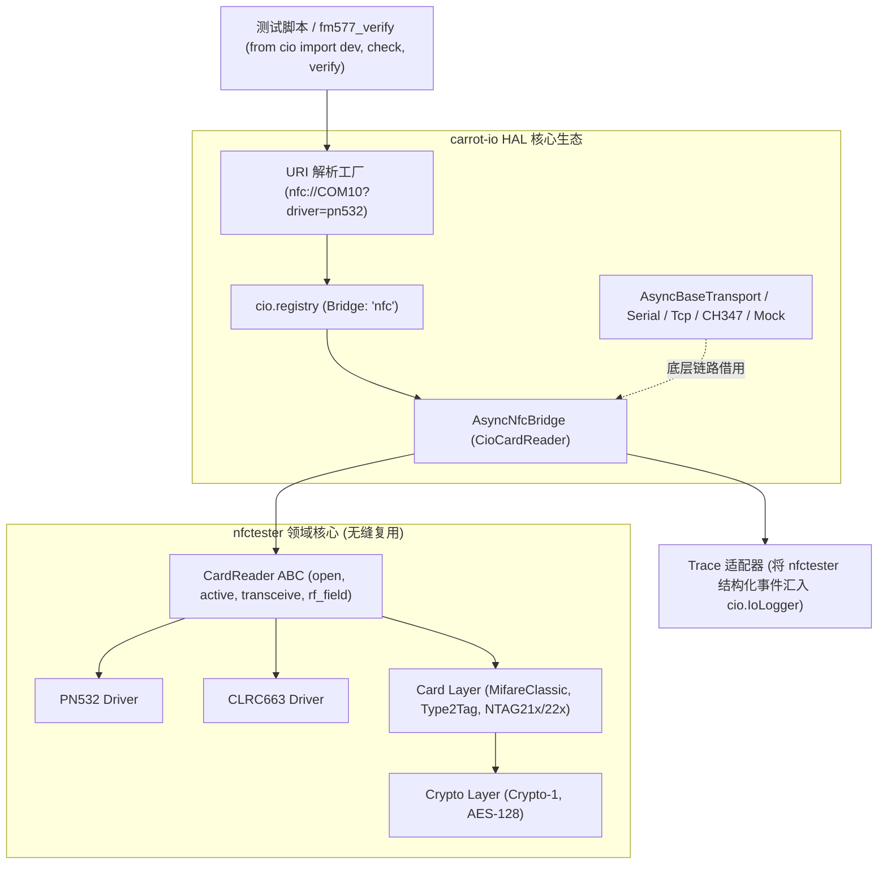

# Carrot-IO 与 NFC 子系统（nfctester / nfcscript）统一融合路线交接书

> **文档版本**：V1.0  
> **更新日期**：2026-09-18  
> **文档定位**：技术架构交接与演进路线指南，明确 `carrot-io`（HAL 通信底座）与 `nfctester` / `nfcscript`（RFID/NFC 协议栈）的融合演进路径。

---

## 一、背景与战略定位 (Vision & Background)

### 1. 核心痛点
- **功能割裂**：目前 `carrot-io` 提供了现代化的纯异步/同步双模 HAL、标准 RFC 3986 单 Scheme URI、硬件借用多路复用以及轻量芯片验证断言能力；而 `nfctester`（及上层 `nfcscript`）拥有成熟的 9 层 RFID 协议架构、芯片驱动（PN532/CLRC663）及卡片逻辑（Mifare、NTAG、Type 2），但其底层传输仅硬编码依赖简单的单机串口。
- **配置分散**：业务验证脚本（如 `fm577_verify`）中往往需要同时在 `.env` 中维护 `CIO_DEVICE`（走 I2C）与 `NFC_PORT` / `NFC_READER`（走 NFC），调用范式不统一，存在历史过渡痕迹。

### 2. 演进终局
构建以 `carrot-io` 为纯净硬件通信底座、`nfctester` 为 NFC 领域能力核心的统一硬件测试生态：
- **统一 URI 表达**：上位机仅凭标准 URI（如 `nfc://COM10?driver=pn532` 或 `nfc://COM3?driver=pn532&bus=i2c&addr=0x24`）即可一键完成读卡器挂载；
- **全通道能力解锁**：NFC 芯片不再局限于串口，天然获得通过 I2C、SPI、沁恒 CH347、远程 RPC 甚至纯内存 Mock 驱动的能力；
- **极简 DSL 闭环**：通过 `from cio import dev, check, verify` 一站式完成“上电 -> 寄存器配置 -> 寻卡 -> 卡片认证 -> 读写验证 -> 结构化看板输出”全流程。

---

## 二、当前资产与架构现状盘点 (Current State Analysis)

### 1. `carrot-io` (HAL 底座) 已就绪能力
| 基础设施模块 | 当前就绪状态 | 为 NFC 提供的能力支撑 |
| :--- | :---: | :--- |
| **标准 URI 工厂** | ✅ V1.10.1 已落地 | 支持单 Scheme `nfc://{address}?driver={driver}&bus={bus}&transport={transport}` 解析 |
| **协议桥注册表** | ✅ 已就绪 | `registry.register_bridge("nfc", "pn532", BridgeCls)` 动态挂载与查找机制 |
| **单例注入门面** | ✅ 已就绪 | `from cio import dev` 原生提供 `dev.nfc` 访问路由；兼容 `CIO_NFC` 与原 `NFC_PORT` 配置 |
| **异步/同步双模** | ✅ 已就绪 | 100% 异步核心 + `SyncTransportWrapper`，测试脚本无需手写 `async/await` |
| **硬件多路复用** | ✅ 已就绪 | 1 对 N 借用协议，同一物理串口可同时派生并安全共用 I2C、GPIO 与 NFC 信道 |
| **断言验证子系统** | ✅ 已就绪 | `cio.check` / `cio.require` / `cio.verify` 提供位掩码、Hex 对比与看板生成 |

### 2. `nfctester` (NFC 领域层) 核心资产
```text
  Layer 1: 硬件传输层 (Hardware) -> Transport ABC (仅 write, read, flush_input, close)
  Layer 2: 驱动层 (Drivers)       -> CardReader ABC, PN532_HSU, CLRC663 (包含位帧、CRC、RF 控制、寻卡、Mifare 硬件认证)
  Layer 3: 卡片逻辑层 (Cards)     -> BaseTag, Type2Tag, NTAG21x, NTAG22x, MifareClassicCard
  Layer 4: 加密算法层 (Crypto)    -> BaseCrypto, MifareCrypto1, AES128Crypto
  Layer 5: 通用工具层 (Utils)     -> CRC, BitOps
  Layer 6: 跟踪控制层 (Trace)     -> TraceManager, TraceHandler, TraceFormatter (DRIVER/PROTOCOL 分层追踪)
  Layer 7: 协议解析层 (Parsers)   -> TableParser, PN532HSUParser, MifareClassicParser, T2TParser
  Layer 8: 注册与会话 (Registry)  -> CardReaderRegistry, CardRegistry, ParserRegistry
```

---

## 三、系统集成架构蓝图 (Architecture Blueprint)



### 依赖关系决策：
- **物理隔离原则**：`carrot-io` 核心代码库保持零强制依赖 `nfctester`；
- **挂载模式**：
  - **模式 A (插件化/依赖引入)**：通过在 `carrot-io` 的 `pyproject.toml` 可选依赖声明 `nfc = ["nfctester"]`，安装后在 `cio.composite.nfc` 自动暴露桥接类；
  - **模式 B (Entry-Points 发现机制)**：`nfctester` 在自身的 `entry_points` 中注册为 `cio.bridges` 的 `"nfc"` 提供者，安装 `nfctester` 后无需修改 `cio` 即可开箱即用。

---

## 四、分阶段落地实施路线 (Phased Roadmap)

### 阶段一：传输层契约桥接与 Reader 适配 (Bridge Adapter)
- **核心目标**：使 `cio.connect("nfc://COM10?driver=pn532")` 能一行代码创建并初始化读卡器。
- **任务清单**：
  1. **构建 `CioTransportAdapter`**：
     - 在 `nfctester.hardware` 中新增（或在适配层实现）基于 `cio.AsyncBaseTransport` 的传输适配类，实现 `nfctester.Transport` 的契约（`write`, `read`, `flush_input`, `close`）；
     - 将底层物理流直接接入 `cio.SerialTransport` 或 `cio.SyncTransportWrapper`。
  2. **实现 `AsyncNfcBridge`**：
     - 作为 `cio.composite` 的新协议桥，继承 `AsyncBaseTransport`，内部持有 `CardReader` 实例；
     - 暴露并转发 NFC 第一公民方法：`open()`, `close()`, `active()`, `transceive()`, `rf_field`, `get_version()`；
     - 将自身向 `registry.register_bridge("nfc", ["pn532", "clrc663"], AsyncNfcBridge)` 注册。
  3. **单元与 Mock 验证**：
     - 编写 `tests/test_nfc_bridge.py`，使用 Mock 底座验证驱动帧组包与寻卡激活逻辑。

### 阶段二：异构底层总线与多路复用扩展 (Heterogeneous Bus Support)
- **核心目标**：彻底打破 NFC 芯片只能直连电脑串口的物理限制，支持通过单片机协议桥（I2C/SPI）、专用芯片（CH347）和网络远程驱动。
- **任务清单**：
  1. **I2C / SPI 挂接 PN532 支持**：
     - 当 URL 指定 `nfc://COM3?driver=pn532&bus=i2c&addr=0x24` 时，`factory.py` 先生成 `i2c://COM3` 逻辑通道，再将 I2C 读写契约包装为 PN532 I2C 驱动所需的底层传输；
  2. **CH347 原生硬件总线挂接**：
     - 支持 `nfc://0?transport=ch347&bus=i2c&driver=pn532`，走高速 USB 硬件直接与射频前端芯片通信；
  3. **硬件借用与事务排它验证**：
     - 实测在单一串口 `COM3` 上，同时进行传感器 I2C 寄存器读取与 PN532 NFC 寻卡，验证 `CarrotBridge._transaction_lock` 保证多协议零撞车。

### 阶段三：观测流（Trace）与热路径内存日志融合 (Trace Unification)
- **核心目标**：将 `nfctester` 强大的协议解析能力（`TraceManager`, `ParsedFrame`, `[7 bits]` 标注）无损汇入 `cio` 内存日志。
- **任务清单**：
  1. **Sink 回调桥接**：
     - `nfctester.trace.manager.add_sink(...)` 支持结构化 `TraceEvent` 回调；
     - 在 `AsyncNfcBridge` 中挂载该 sink，当底层发生 TX/RX 时，将解析好的标签与摘要直接存入 `cio.Logger` 的历史队列；
  2. **统一的 `dev.dump_history()`**：
     - 测试完成后调用 `dev.nfc.dump_history()`，即可统一打印包含 `[PROTOCOL]`、`[DRIVER]`、时间戳和位级标注的高亮通信全景图。

### 阶段四：卡片协议层与芯片自动化断言闭环 (Card & Verify Integration)
- **核心目标**：让芯片产测验证与卡片测试脚本达到极致极简。
- **任务清单**：
  1. **卡片对象直接衍生**：
     - `reader.card("mifare")` 或 `reader.card("t2t")` 快速获取上层卡片对象；
  2. **断言框架深度集成**：
     - 结合 `cio.check` 与 `cio.require`：
       ```python
       from cio import dev, check, require, verify

       with dev:
           verify.reset()
           # 1. 寻卡强断言 (无卡直接熔断)
           card_info = require.not_none(dev.nfc.active(), name="NFC Field Detect")
           require.len(card_info.uid, 4, name="UID Length Check")
           
           # 2. 卡片业务读写与软断言校验
           tag = dev.nfc.card("t2t")
           page4 = tag.read_page(4)
           check(page4[:2], [0x12, 0x34], name="Page 4 Header")
           
           # 3. 输出标准化测试看板
           verify.summary()
       ```

---

## 五、关键技术决策与架构红线约束 (Constraints & Invariants)

在进行 NFC 子系统融合时，必须严格遵守以下工程红线（引自通用红线通用规范 V1.4）：

1. **核心契约轻量与零重度依赖（红线 5）**：
   - 严禁在 `cio/core/` 内硬编码 `import nfctester`；所有 NFC 领域适配必须物理隔离在 `cio/composite/nfc.py` 或独立适配插件中，按需加载并提供清晰的 `DriverMissingError` 降级指引。
2. **纯异步核心与通用同步调度（红线 9 & CIO Invariant 1）**：
   - 新增的 `AsyncNfcBridge` 必须原生基于纯异步协程实现（`async def active`, `async def transceive`）；
   - 同步调用 100% 自动由基类继承的 `dev.sync`（`SyncTransportWrapper`）调度，**严禁手写重复的专用同步读卡器类**。
3. **硬件所有权借用生命周期（CIO Invariant 8）**：
   - 当 NFC 桥挂载在复合底座（如通过 `CarrotBridge` 走 I2C）时，`dev.nfc.close()` 仅注销读卡器逻辑状态并关闭 RF 天线场，**严禁级联关闭底层物理串口/硬件底座**。
4. **统一强类型转换（红线 11 & CIO Invariant 6）**：
   - 数据交互出入参全面拥抱 `BytesLike`（`bytes | list[int] | bytearray`），在适配边界统一通过 `cio.ensure_bytes` 处理，严禁散落散装的 Hex 转换。
5. **断言真实性与零假阳性（红线 23）**：
   - 寻卡超时、CRC 校验错误、NACK 响应必须显式反映为异常或断言失败，严禁吞异常返回空假数据掩盖硬件现场。

---

## 六、交接检查清单与后续推进步骤 (Handover Checklist)

- [ ] **Step 1**：在 `cio/composite/` 目录下创建 `nfc.py`，实现标准契约的 `AsyncNfcBridge`。
- [ ] **Step 2**：实现 `CioTransportAdapter`，打通 `nfctester` 驱动层对 `cio` 底座的调用。
- [ ] **Step 3**：在 `cio/core/registry.py` 中为 `nfc` 协议桥注册默认驱动与适配类。
- [ ] **Step 4**：更新 `d:\Projects\fm577\fm577_verify\scripts\` 下的现有脚本（如 `nfc_reqa.py`），验证向标准 `from cio import dev` + `dev.nfc` 架构迁移的开箱即用体验。
- [ ] **Step 5**：编写完整的全链路自动化在环与 Mock 回归测试，确保 `uv run pytest -m "not hardware"` 100% 通过。
